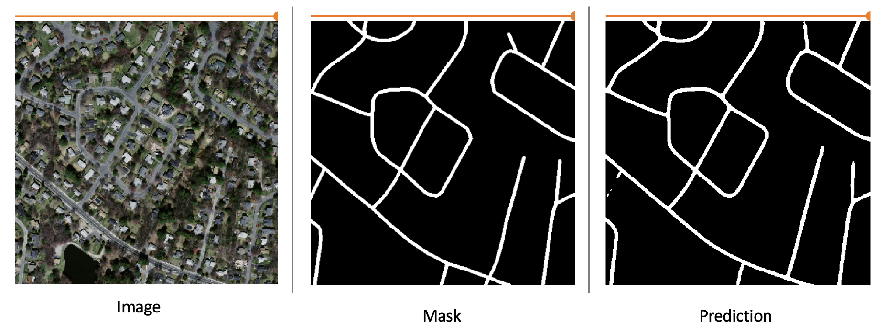

# satellite-road-extraction-service

This repository contains models, pre-processing, post-processing scripts to extract road  surface from satellite imageries.

**Detail description of the project can be found in [Road_Extraction_from_Satellite_Imageries.docx](Road_Extraction_from_Satellite_Imageries.docx)**



## Requirements
- Python 3.6 or above


## Installation
From root folder run:
- pip install -r requirements.txt


## File Structure
- All scripts for data cleaning and data preprocessing are inside preprocessing directory.
    - [preprocessing/data_cleaning.ipynb](preprocessing/data_cleaning.ipynb) contains data cleaning code
    - [preprocessing/preprocessing_script.ipynb](preprocessing/preprocessing_script.ipynb) contains data preprocessing code.

- All scripts related to models are present in models directory.
    - [models/efficientUnet.ipynb](models/efficientUnet.ipynb) contains model training code for unet with efficientNetB4 Backbone.

- All scripts for inference and model evaluations are present in inference_evaluation directory.
    - [inference_evaluation/efficientUnet_eval.ipynb](inference_evaluation/efficientUnet_eval.ipynb) contains inference, post-processing and evaluation code.
    - [inference_evaluation/tf_serving_client_util.ipynb](inference_evaluation/tf_serving_client_util.ipynb) contains code to make gRPC/Rest inference call to deployed tensorflow server instance, post-process the prediction and evaluate the prediction.

- All scripts related to model deployment using tf-serving are present in deployment directory.
    - [deployment/tf_serving.ipynb](deployment/tf_serving.ipynb) contaiins code to build efficientUnet saved_model.pb file for tensorflow serving.

- Directory cb contains, code for various callbacks used during training.
    
**For more details refer, [Road_Extraction_from_Satellite_Imageries.docx](Road_Extraction_from_Satellite_Imageries.docx)**


## Training and Inference
#### Weights File
- [road_extraction_outputs/weights](road_extraction_outputs/weights) contains trained model weights.
#### Tensorboard logs
- [road_extraction_outputs/logs](road_extraction_outputs/logs) contains tensorboard logs. To visualised in browser, from root folder run:
**tensorboard --logdir road_extraction_outputs/logs/train_data/**
#### Test Results
- [road_extraction_outputs/test_results](road_extraction_outputs/test_results) contains inference results on test dataset.
- [road_extraction_outputs/test_results/test_vis.html](road_extraction_outputs/test_results/test_vis.html) has test results visualised in jupyter notebook (Takes some time to load).
#### Tensorflow serving
- [road_extraction_outputs/road_segmentation](road_extraction_outputs/road_segmentation) contains saved_model.pb file for tf serving deployment.


## Deployment
To create tensorflow server:
#### Requirements:
- docker

#### Tensorflow server with Docker:
From root folder, run:

```
docker pull tensorflow/serving
```

```
MODEL="$(pwd)/road_extraction_outputs"
```

```
docker run -t --rm -p 8500:8500 -p 8501:8501 -v "$MODEL/road_segmentation:/models/road_segmentation" -e MODEL_NAME=road_segmentation tensorflow/serving &
```

Once server is up, model status can be checked using:

```
curl http://localhost:8501/v1/models/road_segmentation
```

Use this script to make call to tensorflow server (contains code to make gRPC/Rest inference call to deployed tensorflow server instance, post-process the prediction and evaluate the prediction):
[inference_evaluation/tf_serving_client_util.ipynb](inference_evaluation/tf_serving_client_util.ipynb) 


